Refer back to HW3 of Stat 505.  Reanalyze the same data in SAS.

#. Plot the data in a manner which allows us to easily
          compare survival at each combination of treatment and
          chemical. 
          
      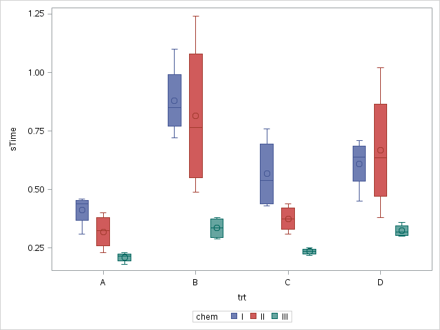
      
      
          
#. Write out the full interaction model.  
   $$ y_{ijk} = \mu + \alpha_i + \beta_j + (\alpha\beta)_{ij} + \epsilon_{ijk},\ i \in \{A,B,C,D\}, j = 1,\ldots,3,\ k = 1,\ldots,4$$
   
#. Fit  the interaction model in SAS.       
       i. Show the estimated coefficients.  
          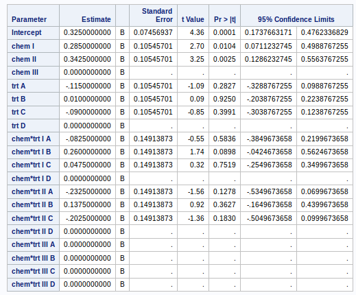 
          
	     ii. Provide either the Type I or Type III output table,
	         and explain why you think this table is preferred.  Is the
           interaction needed?   
           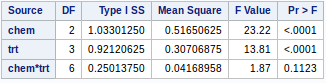
        
        *There is only weak evidence that the difference in mean survival times among levels of the chemical changes across treatment (p-value=$0.1123$ from F-stat$=1.87$ on $6$ and $36$ df). The interaction is not needed*.    \newline
                                           
        *I prefer the type I sequential sums of squares in this case. The chemical row in the above table compares a single mean model to a model with chemical as the only predictor. The treatment row in the above table compares a model with chemical and treatment as predictors to a model with chemical as the only predictor*.  \newline
        
        *The last row in the table is the same regardless of whether we use type I or type III. If we use type III sums of squares, the chemical and treatment rows don't make much sense because we usually do not remove main effects when they are included in an interaction term in the model. For this reason, I like type I sums of squares better*. \newline  
        
       iii. What combination of Greek letters is
	            estimated by each coefficient shown?    \newline
              
         *Note here that SAS sets the last level of each variable as the reference level. Therefore, treatment D and chemical III are the reference levels. The following table shows what combination of Greek letters are estimated by the coefficients that are not set to $0$*.  
         
    ---------------------------------------------------------------------------
    SAS row     Greek Letters
    ----------- ---------------------------------------------------------------
    Intercept      $\mu+\alpha_D+\beta_3+(\alpha\beta)_{D3}$     

    Chem 1       $\beta_1-\beta_3+(\alpha\beta)_{D1}-(\alpha\beta)_{D3}$  

    Chem 2         $\beta_2-\beta_3+(\alpha\beta)_{D2}-(\alpha\beta)_{D3}$ 

    Trt A          $\alpha_A-\alpha_D+(\alpha\beta)_{A3}-(\alpha\beta)_{D3}$ 

    Trt B       $\alpha_B-\alpha_D+(\alpha\beta)_{B3}-(\alpha\beta)_{D3}$ 

    Trt C       $\alpha_C-\alpha_D+(\alpha\beta)_{C3}-(\alpha\beta)_{D3}$ 

    trt*chemA1  $(\alpha\beta)_{A1}-(\alpha\beta)_{D1}-(\alpha\beta)_{A3}+(\alpha\beta$
                 $)_{D3}$

    trt*chemB1  $(\alpha\beta)_{B1}-(\alpha\beta)_{D1}-(\alpha\beta)_{B3}+(\alpha\beta)_{D3}$

    trt*chemC1  $(\alpha\beta)_{C1}-(\alpha\beta)_{D1}-(\alpha\beta)_{C3}+(\alpha\beta)_{D3}$

    trt*chemA2  $(\alpha\beta)_{A2}-(\alpha\beta)_{D2}-(\alpha\beta)_{A3}+(\alpha\beta)_{D3}$

    trt*chemB2  $(\alpha\beta)_{B2}-(\alpha\beta)_{D2}-(\alpha\beta)_{A3}+(\alpha\beta)_{D3}$

    trt*chemC2  $(\alpha\beta)_{C2}-(\alpha\beta)_{D2}-(\alpha\beta)_{C3}+(\alpha\beta)_{D3}$
    -----------------------------------------------------------------------------------------
       
       iv. Provide the default diagnostic plots and comment on
	            how well the assumptions are met. \newline
              
           *The constant variance assumption is clearly not met. We see a funnel pattern in the residuals vs. predicted values plot, with increasing spread across predicted values. There are also several influential observations, and the distribution of observations is long-tailed.*
        
        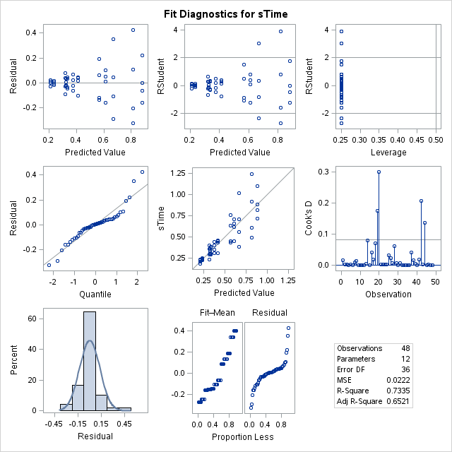        

#. We saw that Box and Cox used these data to illustrate transformations. Transform as you did for Stat 505 and redo the table of coefficients, Type II or III table and diagnostic plots. \newline

       *There is still no evidence for an interaction effect, and the p-value for the interaction term has changed to $0.3867$. The estimates have also changed. The diagnostic plots look much better and there do not seem to be any problems with the assumptions of normality or constant variance.* 
  
      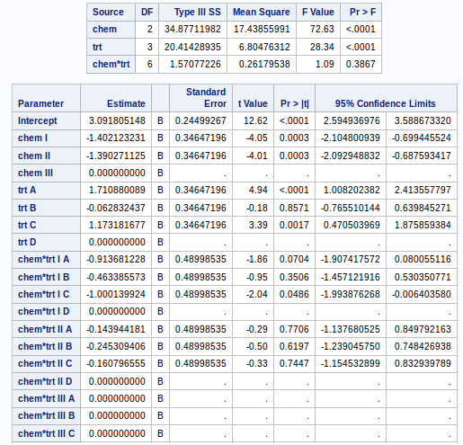
      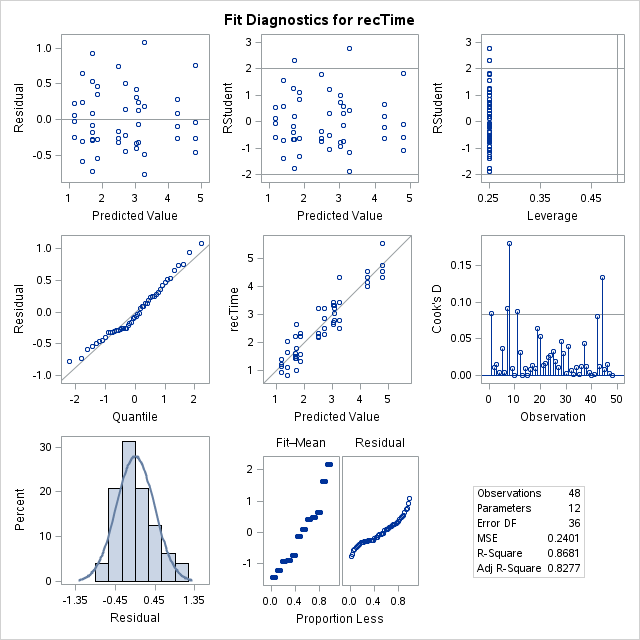
  

#. In HW 5 last fall we looked at thirsty albino rats' rate of level pressing.
  
  
       i.  Provide appropriate plots.   
       
           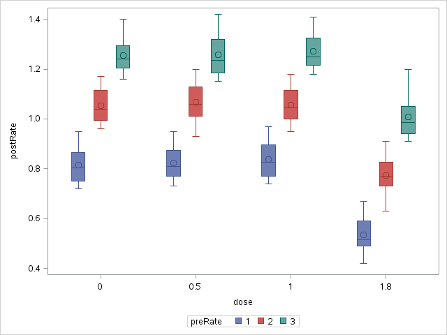
       ii. Write out the model.  \newline
       
           The random effects model is as follows:  \newline
           
       $$ \mathbf{y_i} = \mathbf{X_i} \mathbf{\beta} + b_{i}\mathbf{1} + \mathbf{\epsilon_i}$$ 
       $$ b_{i} \sim N(0,\sigma^2_b)$$
       $$ \epsilon_{i} \sim N(0, \sigma^2)$$

           where the $b_i$'s are the rats with $i \in \{1,2,3,...,12\}$ and 

       $$\mathbf{\beta}=\left[
        \begin{array}[c]{r}
          \mu \\
          \tau_L \\
          \tau_M \\
          \tau_H \\
          \alpha_0 \\
          \alpha_{0.5} \\
          \alpha_{1} \\
          \alpha_{1.8} 
        \end{array}\right]$$ 
           where the $\tau_k$'s are the preRate effects and the $\alpha_j$'s are the 
           dose effects.       \newline
           
   iii.  Fit using PROC MIXED and interpret the relevant output.  
         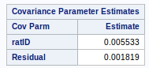
         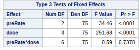
         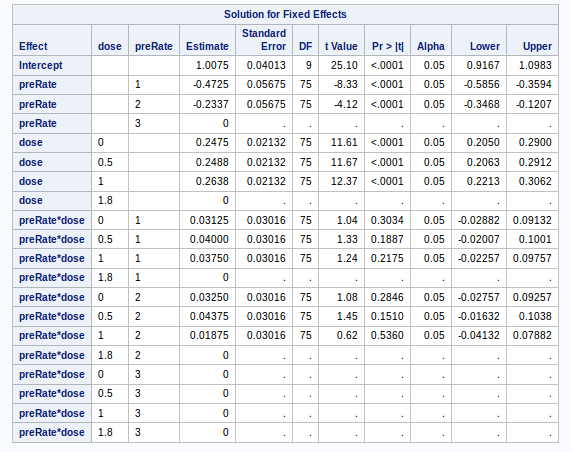  
         *There is strong evidence that the mean post experiment pressing rate depends on the pre-experiment pressing rate after accounting for rat and dose (p-value$<0.0001$ from F-stat$=34.46$ on $2$ and $9$ df). There is also strong evidence that the mean post experiment pressing rate depends on drug dose after accounting for rat and pre-experiment rate (p=value$<0.0001$ from F-stat$=251.68$ on $3$ and $75$ df). There is no evidence that the difference in the mean post experiment pressing rates among doses changes across pre-experiment pressing rates, after accounting for rat (p-value$=0.7378$ from F-stat$=0.59$ on $6$ and $75$ df). We also see that the covariance between observations on the same rat is estimated to be $0.005533$.*  \newline  
         
   iv.   Discuss the diagnostic plots.  
         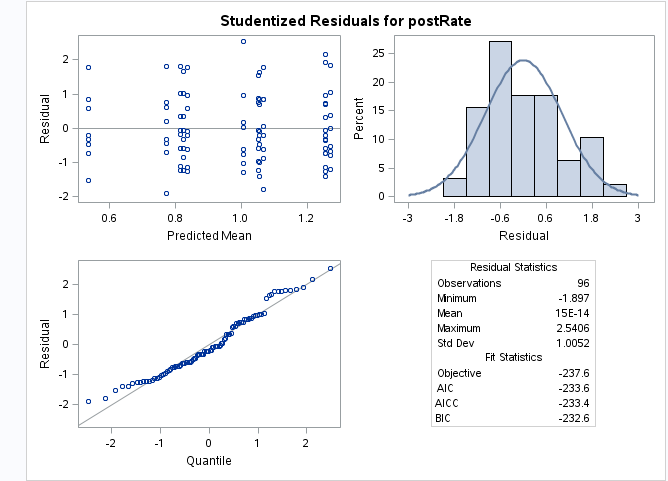  
         *The studentized residuals are mostly between $-2$ and $2$ and the spread is mostly constant across predicted values. There is a long right tail shown in the normal Q-Q plot, but it is not too extreme and I don't expect it to severely interfere with our tests. *
         
        

#Code Appendix

```{r data, eval=FALSE}
DATA rats;
  INFILE "/folders/myfolders/ratSurvival.csv" firstobs=2 delimiter =',';
  INPUT chem $ trt $ sTime;
  ;
RUN;
```

```{r plot, eval=FALSE}
PROC SGPLOT data=rats;
  vbox sTime / category=trt group=chem;
RUN;
```

```{r glm, eval=FALSE}
PROC GLM data = rats plots=diagnostics;
  CLASS chem trt;
  MODEL sTime = chem|trt / ss3 SOLUTION clparm; 
RUN;

```

  
```{r reciprocal, eval=FALSE}
DATA recrats;
  SET rats;
  recTime = 1/sTime;
  ;
RUN;

PROC GLM data = recrats plots=diagnostics;
  CLASS chem trt;
  MODEL recTime = chem|trt / ss3 SOLUTION clparm; 
RUN;
```

```{r data2, eval=FALSE}
DATA drugs;
  INFILE "/folders/myfolders/drugResponse.csv" firstobs=2 delimiter =',';
  INPUT arm ratID $ preRate dose $ rep postRate;
  ;
RUN;
```

```{r sg, eval=FALSE}
PROC SGPLOT data=drugs;
  vbox postRate / category=dose group=preRate;
RUN;
```

```{r mix, eval=FALSE}
PROC MIXED DATA=drugs plots=all;
  CLASS ratID preRate dose rep;
  MODEL postRate = preRate|dose / SOLUTION CL;
  RANDOM ratID;
RUN;
```


