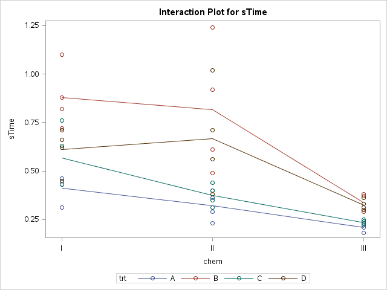

Refer back to HW3 of Stat 505.  Reanalyze the same data in SAS.
<ol>
<li>  Plot the data in a manner which allows us to easily
          compare survival at each combination of treatment and
          chemical. 
          

  
  

  </li>
          
<li>  Write out the full interaction model. </li>
<li>   Fit  the interaction model in SAS. </li>

<ol type="a">
        <li> Show the estimated coefficients. </li>
	      <li> Provide either the Type I or Type III output table,
	  and explain why you think this table is preferred.  Is the
          interaction needed?  </li>
	      <li> What combination of Greek letters is
	  estimated by each coefficient shown? </li>
	      <li> Provide the default diagnostic plots and comment on
	      how well the assumptions are met. </li>
</ol> </ol>
---

---
Here we go $y_{ijk} = \mu + \alpha_i + \beta_j + \epsilon_{ijk}$ 
---

